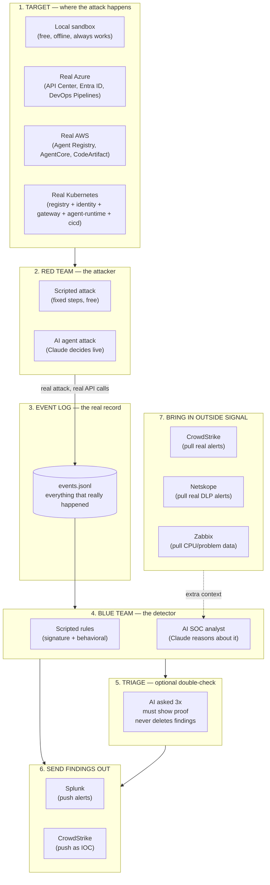
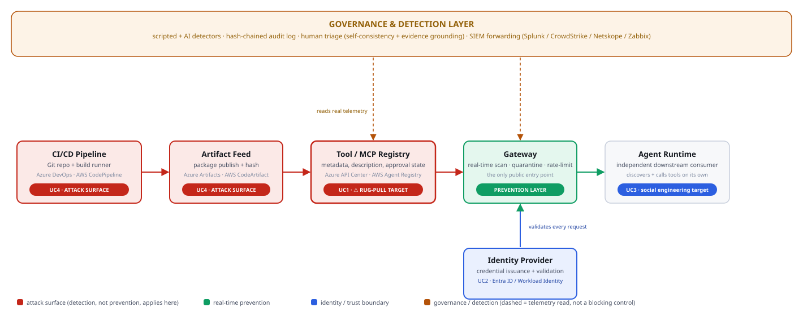

# Purple Team Lab — Full Documentation

**What this is:** a throwaway lab that lets you run real attacks and real detection for AI agent and CI/CD supply-chain security — locally for free, or against real Azure/AWS/Kubernetes infrastructure, with real AI doing both the attacking and the defending. Everything can be deleted in one command when you're done.

**Before anything else, read this if you're thinking about production:** [`docs_assets/ENTERPRISE_REFERENCE_ARCHITECTURE.md`](docs_assets/ENTERPRISE_REFERENCE_ARCHITECTURE.md) — what a real enterprise actually needs for this (grounded in NIST AI RMF, SLSA, Zero Trust, OWASP Agentic/MCP Top 10), and an honest map of exactly which parts of that this lab has already validated versus which parts are organizational decisions no lab can solve for you. Read this before anyone says "let's launch this in production."

**If you're an automated agent setting this up:** this repo has several `requirements.txt` files, not one. The one you almost certainly need is at the **project root** (`anthropic`, `openai`, `boto3`, `azure-identity`, `azure-keyvault-secrets` — everything the harness and every cloud attack script need). `target/requirements.txt` is only for the optional local test server and will NOT have what you need to run anything under `cloud_target/`. See the table in Section 4 for the full breakdown before installing anything.

---

## 0. Before anything else: your project root

Every command in this document is a **full path**, not a relative one — no `cd` into a folder and hope for the best. To use these commands, you only need to know one thing: where you extracted the zip.

**Your project root** (based on what you've told me) is:
```
C:\Users\bruniasj\Downloads\workshop
```

Every command below is written against that exact path. If you move the folder, every command needs the same change — the path, nothing else.

If someone else uses this doc with a different folder location, they just replace `C:\Users\bruniasj\Downloads\workshop` with wherever *they* extracted it, everywhere it appears.

---

## 1. What problem this solves

When you test AI agent or CI/CD security, you have two options:

- Talk about attacks in slides (not convincing, easy to dismiss as "nice try, not real")
- Actually run the attacks and show what gets caught (convincing, hard to argue with)

This project does the second one, safely. It never touches your real company systems.

---

## 2. Architecture — how the pieces fit together



**In plain words:**

1. **Target** — the thing being attacked. Local test app, real Azure/AWS, or a real Kubernetes namespace.
2. **Red team** — the attacker. Either a fixed script, or a real Claude AI agent that decides what to do on its own.
3. **Event log** — every real action gets written down here. This is the single source of truth.
4. **Blue team** — the detector. Either fixed rules (signature-matching AND behavioral pattern detection, combined), or a real Claude AI that reads the log and reasons about it.
5. **Triage** — an optional second AI opinion that checks the detector's findings for mistakes, without ever hiding a real finding.
6. **Send findings out** — push confirmed findings to Splunk (alerts) or CrowdStrike (block list).
7. **Bring outside signal in** — pull real alerts from CrowdStrike, Netskope, and Zabbix so the AI detector has more to work with, not just its own data.

### Where this sits in a real organization

The diagram above shows this lab's own moving parts. The one below shows the
bigger picture — where this pipeline sits inside a real company's AI supply
chain, left to right instead of top to bottom, and mapped to the exact use
cases this lab tests:



Two things worth reading directly off this diagram:

- **Red boxes are attack surface, not defended in real time** — the gateway
  (green) only sits between the registry and the agent runtime. Everything
  to the left of it (the CI/CD pipeline, the artifact feed, the registry
  itself) only has *detection* (the amber governance layer reading
  telemetry after the fact), not *prevention*. That gap is exactly what
  UC1 and UC4 test.
- **The amber arrows are dashed on purpose** — they represent reading
  telemetry, not blocking anything. Confusing "we have a monitoring
  dashboard" with "we have a control" is the single most common gap this
  lab is built to expose.

---

## 3. The four attack scenarios (use cases)

| # | Name | What gets attacked | Real-world tools it maps to |
|---|------|---------------------|------------------------------|
| UC1 | Supply Chain Poisoning | A tool registry — register something safe-looking, then quietly change it after approval | Azure API Center, AWS Agent Registry, Kubernetes (registry + gateway) |
| UC2 | Identity Hijacking | An agent's login credentials — reused from many places at once, like a stolen key | Microsoft Entra ID, AWS AgentCore Identity, Kubernetes (identity + gateway) |
| UC3 | Credential Harvesting | A "helpful" chat agent — tricked into leaking a secret | Local sandbox only |
| UC4 | CI/CD Supply Chain Compromise | The build pipeline — unauthorized workflow trigger, poisoned package, stolen token, persistence marker | Azure DevOps Pipelines + Artifacts, AWS CodePipeline + CodeArtifact, GitHub (PAT-authenticated, `cloud_target/azure/uc4_github_pat_attack.py`), Kubernetes (cicd service) |

UC1, UC2, and UC4 can run against real cloud/Kubernetes infrastructure. UC3 stays local only. UC4 also demonstrates the **cross-branch bridge**: a compromised CI/CD pipeline can register a new tool directly into UC1's real gateway — showing how a supply-chain compromise turns into an MCP-layer compromise.

UC4's GitHub variant is confirmed working end-to-end against a real repository — real PAT authentication, a real commit (`HTTP 201`), and `5/6` detections from the resulting real telemetry. One thing worth knowing if you run it repeatedly: it now correctly checks whether its marker file already exists and includes the required `sha` to update it in place — the first version of this script only handled creating a brand-new file, so a second run against the same repo failed with `422` until this was fixed.

UC2's first-ever live run (local) found and fixed a real bug: the
behavioral velocity check (`CREDENTIAL_MULTI_SOURCE_VELOCITY`, detecting
a stolen credential replayed from multiple IPs in a short window) used a
2-second window that reset on any gap between events. On a machine with
any meaningful network latency — an active VPN, EDR/antivirus connection
inspection, a slow load balancer — that window is unrealistically tight
and the check would silently miss a real attack, not just this lab's
simulated one. Fixed by widening the window to 60 seconds (closer to how
production "impossible travel" detection actually works) and switching
to a proper sliding-window-maximum instead of reset-on-gap, so one slow
request can no longer wipe out everything counted before it. Verified
against 5 scenarios — including the exact slow-network numbers this
bug was found with — before trusting it: the real attack now detects
correctly regardless of network speed, and genuinely benign or
genuinely spread-out credential usage still correctly stays `CLEAN`.
Confirmed clean afterward: `3/3` findings, real target, real telemetry,
repeated twice.

UC3's first-ever live run confirmed the scenario's intended design, not
a bug: of 3 real credential leaks the attack produced, the regex-based
layer only catches 1 (`2/6` findings). This is deliberate — the leaked
API key in this scenario is `sk-lab-FAKE1234567890abcdef`, and the
detection pattern (`sk-[a-zA-Z0-9]{10,}`, no hyphens allowed after the
prefix) only sees 3 characters before hitting the hyphen in `sk-lab-`
and stopping short of the required 10+. This is intentional — a real,
common blind spot in naive regex-based credential scanners against
non-standard key formats. The point is what happens next: the
behavioral layer (`BEHAVIORAL_ESCALATING_HARVESTING_ATTEMPT`) still
caught the attack — 3 extraction-style prompts in 4.1 seconds, flagged
on the pattern of *asking*, independent of whether any individual
response leaked. Two of three real leaks slipped past layer 1; the
attack itself was still caught by layer 2. Confirmed live for the first
time, `2/6` correctly reflecting the designed limitation rather than an
unexpected gap. (The AI-driven detector, `--mode ai`, is designed to
catch the API-key leak content-wise too, via semantic understanding
rather than rigid pattern matching — worth a direct comparison once
available.)

---

## 4. One-time setup

**Option A — with Docker (needed if you want to try the Kubernetes/cloud paths later):**
```
C:\Users\bruniasj\Downloads\workshop> docker compose up -d --build
C:\Users\bruniasj\Downloads\workshop> curl http://localhost:8000/healthz
```

**Option B — without Docker (fastest way to get started right now):**

Open one PowerShell window and leave it running:
```
cd C:\Users\bruniasj\Downloads\workshop\target
pip install -r requirements.txt
python -m uvicorn app:app --host 0.0.0.0 --port 8000
```
(This `requirements.txt` is `target\requirements.txt` — the local test server's own dependencies only. There's a *different*, separate `requirements.txt` at the project root for the harness itself — see the table below.)

**If uvicorn's log lines show up as raw text like `←[32mINFO←[0m` instead of colored text:** this is uvicorn correctly sending ANSI color codes, but Windows' classic PowerShell console not being set up to render them (Windows Terminal handles this by default; the older console host needs to be told to). One-time fix, run once in PowerShell:
```
Set-ItemProperty HKCU:\Console VirtualTerminalLevel -Type DWORD 1
```
Close and reopen PowerShell after running that — colors will render correctly from then on, in this project and everywhere else. (If you'd rather not touch the registry, installing [Windows Terminal](https://aka.ms/terminal) from the Microsoft Store and using that instead of the classic blue console window also fixes it, with no setting to change.)

Then open a **second** PowerShell window for every command below.

**This repo has several `requirements.txt` files — here's exactly which one you need and when:**

| File | What it's for | When you need it |
|---|---|---|
| `requirements.txt` (project root) | The harness itself, plus every real Azure/AWS/OpenAI/GitHub integration (`anthropic`, `openai`, `boto3`, `azure-identity`, `azure-keyvault-secrets`) | Always — this is the one for running `run_exercise.py` and any `cloud_target/*` attack script |
| `target/requirements.txt` | Only the local test server (`fastapi`, `uvicorn`, `pydantic`) | Only if you're running the local sandbox target (Option A/B above) — irrelevant to cloud/Azure testing |
| `k8s/services/*/requirements.txt` (5 files) | Each Kubernetes service's own dependencies | Never installed manually — these get baked into the pods automatically by `deploy_full_architecture.sh`/`.ps1` |

Either way, install the harness's own dependencies once — **the root one**, not `target/requirements.txt`:
```
pip install -r C:\Users\bruniasj\Downloads\workshop\requirements.txt
```

---

## 5. How to use — with full-path examples

Every example is a real, complete command. Copy, paste, adjust the path once if your folder is somewhere else.

### 5.1 The basics: free and offline

```
python C:\Users\bruniasj\Downloads\workshop\harness\run_exercise.py --uc 1 --mode scripted
```

```
python C:\Users\bruniasj\Downloads\workshop\harness\run_exercise.py --uc all --mode scripted
```

### 5.2 Turn on real AI

```
set ANTHROPIC_API_KEY=sk-ant-...
python C:\Users\bruniasj\Downloads\workshop\harness\run_exercise.py --uc 1 --mode ai
```

(PowerShell users: `$env:ANTHROPIC_API_KEY = "sk-ant-..."` instead of `set`.)

### 5.3 The best demo: old rules vs. real AI, side by side

```
python C:\Users\bruniasj\Downloads\workshop\harness\run_exercise.py --uc 3 --mode compare
```

### 5.4 Get a number you can defend, not a one-off story

```
python C:\Users\bruniasj\Downloads\workshop\harness\run_exercise.py --uc 1 --mode compare --runs 10
```

### 5.5 Add a second AI opinion to catch mistakes

```
python C:\Users\bruniasj\Downloads\workshop\harness\run_exercise.py --uc 1 --mode ai --triage
```

### 5.6 Run UC4 — the CI/CD supply-chain scenario

```
python C:\Users\bruniasj\Downloads\workshop\harness\run_exercise.py --uc 4 --mode scripted
```

This one is worth running twice in a row: once with the fixed attack script, once with `--mode ai`, and comparing. It also proves it has **zero false positives** — a clean run against normal, approved CI/CD activity produces no detections at all, which you can see for yourself:
```
python C:\Users\bruniasj\Downloads\workshop\red_team\uc4_cicd_baseline.py --cicd-url http://localhost:8000
python C:\Users\bruniasj\Downloads\workshop\blue_team\uc4_cicd_detector.py
```

### 5.7 Run it against a real cloud account instead of the free sandbox

```
cd C:\Users\bruniasj\Downloads\workshop\cloud_target\azure\infra
.\deploy.sh
```
The script prints two values — export them, then:
```
set AZURE_RESOURCE_GROUP=rg-purple-team-lab
set AZURE_APIC_NAME=<value from deploy.sh output>
python C:\Users\bruniasj\Downloads\workshop\harness\run_exercise.py --uc 1 --cloud azure --mode compare
```

Swap `azure` for `aws` to use AWS instead — setup is in `C:\Users\bruniasj\Downloads\workshop\cloud_target\aws\infra`.

### 5.8 Run it against your own Kubernetes namespace

```
cd C:\Users\bruniasj\Downloads\workshop\k8s
.\deploy_full_architecture.sh
.\port-forward-gateway.sh
```
Leave that second command running in its own window, then in a new window:
```
python C:\Users\bruniasj\Downloads\workshop\harness\run_exercise.py --uc 1 --target http://localhost:8000 --mode scripted
```

For UC4 specifically, forward the `cicd` service instead:
```
cd C:\Users\bruniasj\Downloads\workshop\k8s
.\port-forward-cicd.sh
```
```
python C:\Users\bruniasj\Downloads\workshop\harness\run_exercise.py --uc 4 --target http://localhost:8010 --mode scripted
```

### 5.9 Everything at once — the full professional run

```
python C:\Users\bruniasj\Downloads\workshop\harness\run_exercise.py --uc 2 --mode ai --cloud aws --runs 10 --enrich-crowdstrike --forward-splunk --triage
```

### 5.10 Clean up — leave nothing behind

```
docker compose -f C:\Users\bruniasj\Downloads\workshop\docker-compose.yml down
C:\Users\bruniasj\Downloads\workshop\cloud_target\azure\infra\teardown.sh
C:\Users\bruniasj\Downloads\workshop\cloud_target\aws\infra\teardown.sh
C:\Users\bruniasj\Downloads\workshop\k8s\teardown_full_architecture.sh
```

---

## 6. Connecting to detection tools

**Quick summary of what's possible with each tool:**

| Tool | Can we send it findings? | Can we pull its findings? |
|---|---|---|
| Splunk | Yes | No (not needed — you'd search Splunk directly) |
| CrowdStrike | Yes | Yes |
| Netskope | No | Yes |
| Zabbix | No (it's a monitoring tool, not an alerting channel) | Yes (CPU/resource data + problems, useful for spotting a compromised CI runner) |

Every connector left unconfigured skips cleanly — no error, just a note that it was skipped.

### Splunk
```
set SPLUNK_HEC_URL=https://your-splunk-server:8088/services/collector/event
set SPLUNK_HEC_TOKEN=your-hec-token
python C:\Users\bruniasj\Downloads\workshop\harness\run_exercise.py --uc 1 --mode scripted --forward-splunk
```

### CrowdStrike
```
set CROWDSTRIKE_CLIENT_ID=your-client-id
set CROWDSTRIKE_CLIENT_SECRET=your-client-secret
python C:\Users\bruniasj\Downloads\workshop\harness\run_exercise.py --uc 2 --mode ai --enrich-crowdstrike
```

### Netskope
```
set NETSKOPE_TENANT_HOSTNAME=yourtenant.goskope.com
set NETSKOPE_API_TOKEN=your-api-token
python C:\Users\bruniasj\Downloads\workshop\harness\run_exercise.py --uc 2 --mode ai --enrich-netskope
```

### Zabbix
```
set ZABBIX_URL=https://zabbix.example.com
set ZABBIX_API_TOKEN=your-api-token
python C:\Users\bruniasj\Downloads\workshop\harness\run_exercise.py --uc 4 --mode ai --enrich-zabbix
```

---

## 7. What's in each folder

```
C:\Users\bruniasj\Downloads\workshop\
├── target\              the free local test app (UC1-3, all-in-one)
├── red_team\             fixed-script attacks (free, no AI) — UC1-4
├── blue_team\            fixed-rule detectors (free, no AI) — UC1-4, plus false-positive triage
├── ai_red_team\          real Claude agent that attacks on its own
├── ai_blue_team\         real Claude analyst that detects on its own
├── cloud_target\         real Azure/AWS attack scripts — UC1, UC2, UC4
├── k8s\                  real Kubernetes deployment — registry, identity, gateway, agent-runtime, cicd
│   └── services\         source code for each Kubernetes service
├── connectors\           Splunk, CrowdStrike, Netskope, Zabbix integration
├── research\             a real, verified bypass technique against a published MCP scanner
├── harness\              run_exercise.py — the command you actually run
└── logs\                 events.jsonl — the real record of everything that happened
```

---

## 8. Safety reminders

- Nothing in this lab ever touches your real company systems. Local mode runs in a throwaway process or container. Cloud/Kubernetes mode runs in a brand-new, empty resource group / namespace you create just for this.
- The AI attacker can only do what the tools we hand it allow — nothing more. It cannot reach outside the lab.
- Get written authorization before running any of this, even against your own throwaway cloud account, if your organization requires it for security testing.
- Run the teardown scripts after every use. Nothing should be left running.

---

## 9. If a command doesn't work

- **`docker: command not found`** — Docker Desktop isn't installed. Use Option B in section 4 (no Docker needed), or install Docker Desktop first.
- **`can't open file '...\run_exercise.py'`** — you used a relative path. Every command in this document is a full path already; copy it exactly, only changing `C:\Users\bruniasj\Downloads\workshop` if your folder is elsewhere.
- **The harness seems to hang forever** — the target isn't running. Start it first (section 4), then confirm with `curl http://localhost:8000/healthz` before running anything else. As of this version, the harness fails fast with a clear error instead of hanging if the target is unreachable — if you still see it hang, you're on an older copy of this lab.
- **`PermissionError` involving `/logs`** — you're on an old copy of this lab. Current versions store logs inside the project folder, not at the filesystem root, and need no extra setup.

---

## 10. Real bugs found by independent review (CCCS)

Before executing anything, an independent CCCS reviewer ran a full code
review of this repo first. Three real defects were found this way —
recorded here because catching things via review before execution, not
after something breaks, is exactly the discipline this lab is built to
demonstrate, and it deserves to be documented as such.

1. **UC4 never worked against the basic local target.** `target/app.py`
   (what `docker compose up` starts) had real endpoints for UC1, UC2,
   and UC3 — but none for UC4. `python run_exercise.py --uc 4` against
   the default local setup was always going to fail; UC4 only ever
   worked via Kubernetes or a real GitHub repo. Fixed by porting UC4's
   endpoints from `k8s/services/cicd/app.py` into `target/app.py`.
   Verified live: `8/8` findings, first time UC4 has worked against the
   plain local target.

2. **A Splunk auto-forward footgun.** `--prod` auto-enabled
   `--forward-splunk` whenever `SPLUNK_HEC_URL`/`SPLUNK_HEC_TOKEN`
   happened to be set in the environment — even if the user never
   passed `--forward-splunk` in that run. Unlike auto-enabling
   `--triage` (read-only analysis), this one sends data to a real
   external system: if those variables were left over from unrelated
   work, or pointed at a real production Splunk instance, `--prod`
   would silently forward this lab's fake attack data to it. Fixed —
   sending data out now always requires the explicit flag, every time;
   `--prod` prints a note instead of auto-triggering if the env vars
   are present but the flag wasn't passed. Verified: same env vars set,
   no flag passed, no forward attempted — just the note.

3. **A missing `docker-compose.yml`** was reported from the pushed
   copy of this repo. The file exists and is correct in the source
   copy this documentation ships with — if you're missing it, it means
   it didn't make it into your `git push`; check with `git ls-files |
   grep docker-compose` locally, or look directly on GitHub, rather
   than assuming the file was never built.
