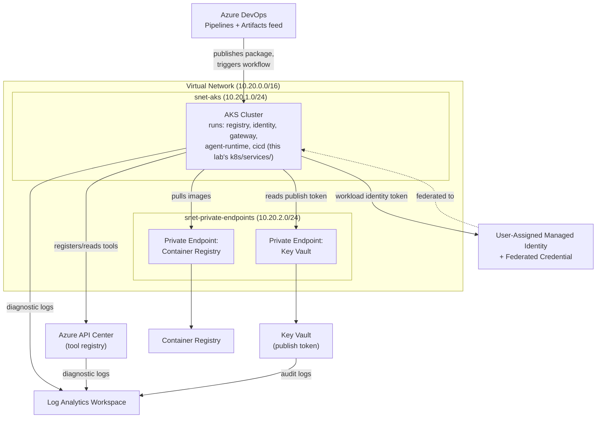

# Realistic AI Supply Chain Lab — Architecture Specification

**For: your Azure lab environment**
**Purpose:** a disposable, isolated Azure environment that mirrors how a real
enterprise AI agent supply chain is actually built — not simulated
services, but the real Azure products a production deployment would use,
sized down and isolated for a workshop.

Everything below has a single teardown command (`terraform destroy`) and
lives in its own resource group, touching nothing else in the subscription.

---

## What this maps to, and why each piece is real

| Component | Real Azure service | What it represents |
|---|---|---|
| Tool/MCP registry | **Azure API Center** | Where AI agent tools get registered, versioned, and governed — this is Microsoft's actual current product for this (GA), not a stand-in |
| Agent workload identity | **Microsoft Entra ID + Workload Identity Federation** | How a real AKS-hosted agent authenticates to Azure without a stored secret — the current recommended pattern, not API keys |
| CI/CD pipeline | **Azure DevOps Pipelines + Azure Artifacts** | Real build/publish pipeline — the actual attack surface for a software supply-chain compromise |
| Secrets | **Azure Key Vault** | Where a real publish token would actually live, with real access policies and real audit logs |
| Compute for the registry/gateway/identity services | **Azure Kubernetes Service (AKS)** | Runs this lab's existing gateway architecture (`k8s/services/`) for real, with Azure's real network policy enforcement instead of a generic cluster |
| Network segmentation | **VNet + Subnets + NSGs** | The zero-trust boundary between the gateway and the backends — enforced by real Azure networking, not just Kubernetes NetworkPolicy |
| Container images | **Azure Container Registry** | Real image build/push/pull, instead of this lab's local-mode shortcut of mounting Python source into a stock image |
| Centralized logging | **Log Analytics Workspace** | Where a real SOC would actually receive this environment's telemetry |

Nothing here is a toy substitute for the real product. The local/free
version of this lab (the one you've been running) exists specifically so
you can develop and rehearse without touching real infrastructure — this
is the version you graduate to when you want the workshop to survive a
"but would this actually work in our environment?" question.

---

## Architecture diagram

---

## Sizing (kept deliberately small — this is a lab, not production capacity)

- AKS: 1 node pool, 2 nodes, `Standard_B2s` (burstable, cheap) — enough to
  run all 5 services in `k8s/services/` comfortably
- Key Vault: `standard` SKU
- Container Registry: `Basic` SKU
- Log Analytics: pay-as-you-go, 30-day retention (this is a workshop, not
  a compliance archive)

---

## What's verified vs. what needs a check before you apply

Being direct about this rather than letting your engineer find out mid-deploy:

**Verified — these are long-established `azurerm` Terraform resources,
stable for years, high confidence:**
- Resource group, virtual network, subnets, NSGs
- AKS cluster, user-assigned identity, federated identity credential
- Key Vault + secret
- Log Analytics workspace
- Container registry

**NOT verified — could not reach the Terraform registry from where this
was built (no network path in that environment):**
- The exact current `azurerm` resource name/schema for **Azure API
  Center**. It's a newer service (GA in 2024, this lab already validated
  its `az apic` CLI commands directly against Microsoft's current CLI
  reference in earlier work). The Terraform block below is written using
  the schema I'd expect based on Microsoft's other services, but **run
  `terraform validate` before `apply` and be ready for your engineer to
  adjust this one resource** if the schema has moved. A CLI-based
  fallback (`az apic` commands, already proven to work in this lab) is
  included as a backup path if the Terraform resource doesn't match.
- Azure DevOps resources need the separate `azuredevops` Terraform
  provider (not `azurerm`), which requires a Personal Access Token from
  your DevOps org — this is called out explicitly in `devops.tf` rather
  than silently assumed.

If your CCCS contact hits a schema mismatch on API Center specifically,
that's the expected, already-flagged risk — not something wrong with the
rest of the plan.
